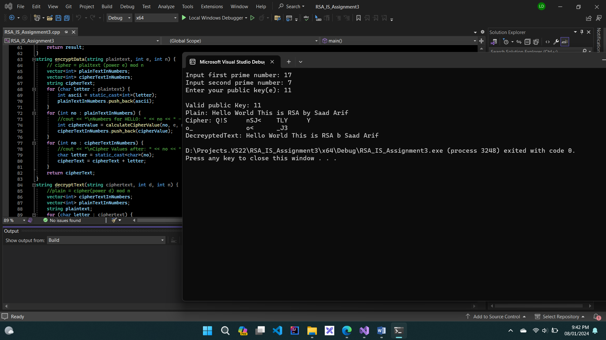

# RSA-Algorithm
RSA algorithm implemented in c++

## Overview
This C++ program demonstrates the RSA algorithm for encryption and decryption. It performs the following tasks:
- Reads text from "plain-text.txt"
- Encrypts the text and displays the encrypted result
- Decrypts the text and displays the decrypted result

## Screenshot

